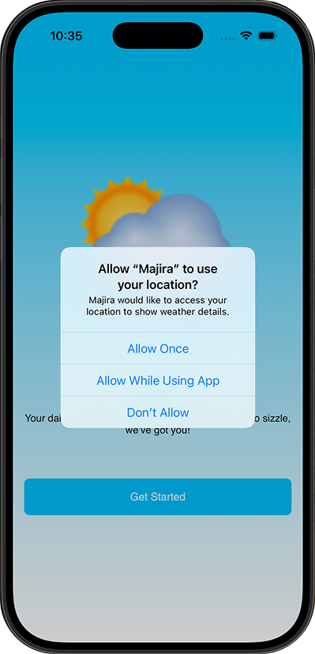
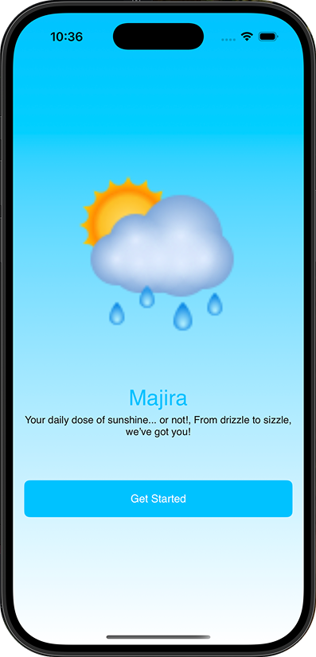
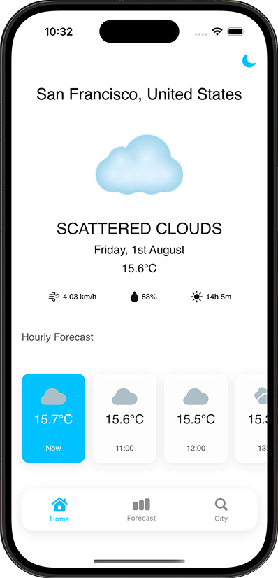
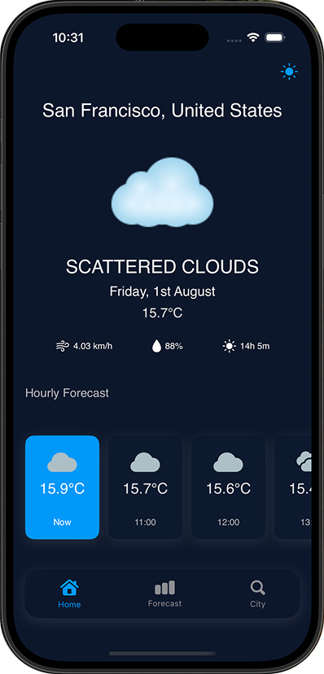
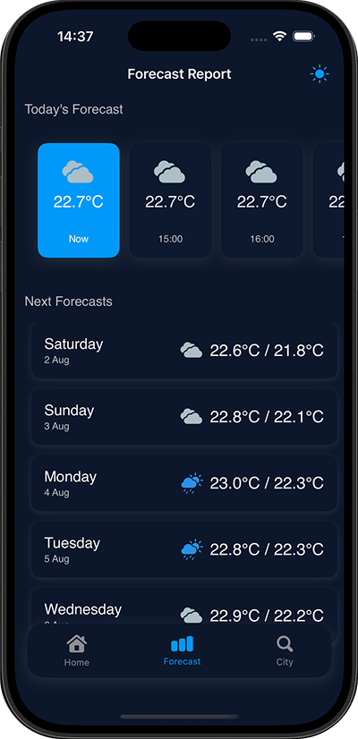
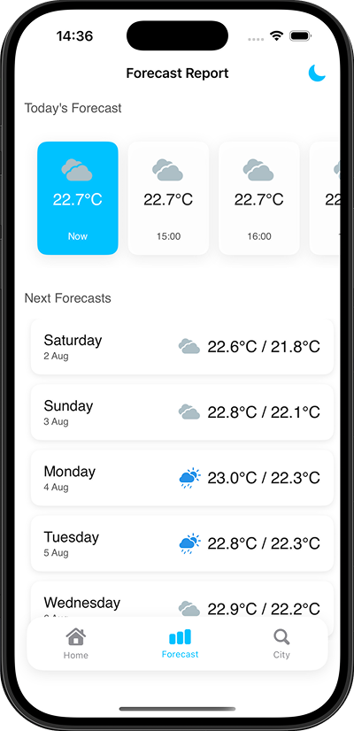
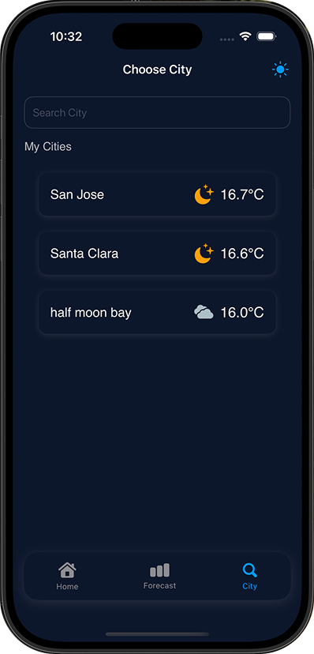
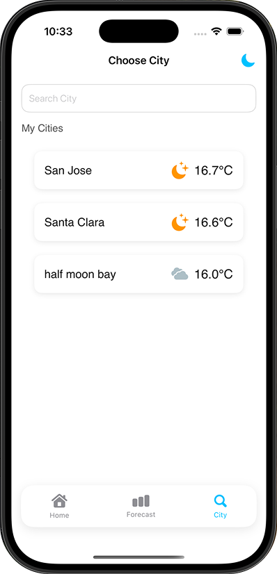
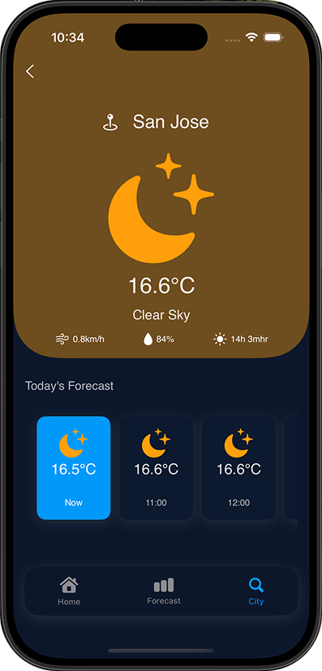
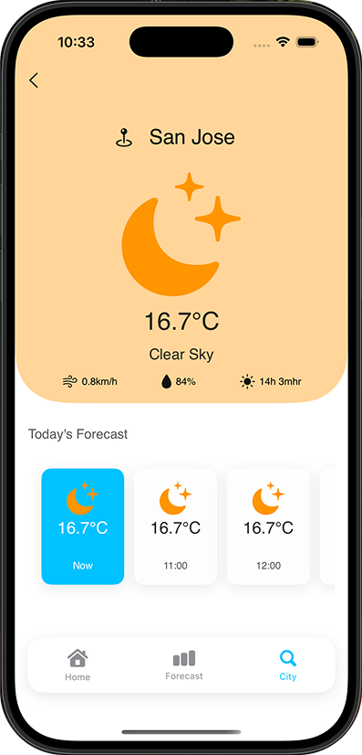

# 🌤️ Majira App
A simple and clean weather app that shows current conditions, hourly updates, and upcoming forecasts. Built with SwiftUI and powered by OpenWeather, it's designed to give quick, beautiful insights into your local weather at a glance

## Structural design pattern
The app follows the Model-View-ViewModel (MVVM) pattern, enhanced with principles from Clean Architecture to ensure better separation of concerns and maintainability.
- Models hold the core data and business logic. These are typically lightweight structs or simple classes.
- Views handle the UI layer and display visual elements using SwiftUI.
- ViewModels serve as the bridge between views and models, transforming raw data into view-ready formats. They're implemented as classes to support state observation and reference passing.

By combining MVVM with clean architecture layers (such as Use Cases, Repositories, and Services), the codebase stays modular, testable, and easy to scale as the app grows.

### Landing Screen
 

### Home Screen
  

### Forecast Screen
  

### City Screen
 

### City Details Screen
 

## 🛠️ Tech Stack.

- [**Swift**](https://developer.apple.com/swift/)
  Swift is a powerful and intuitive programming language developed by Apple for iOS, macOS, watchOS, and tvOS development. It is designed to be fast, safe, and modern, making it easier to write reliable and maintainable code.

- [**SwiftUI**](https://developer.apple.com/xcode/swiftui/)
  SwiftUI is a modern UI toolkit introduced by Apple that allows developers to build user interfaces across all Apple platforms using declarative Swift syntax. It enables faster development with real-time previews and seamless integration with Swift.

- [**Core Data**](https://developer.apple.com/documentation/coredata)
  Core Data is Apple’s framework for managing the model layer of applications. It provides powerful tools for object graph management and persistence, allowing developers to store and query data efficiently on-device.

- [**Clean Architecture**](https://www.geeksforgeeks.org/system-design/complete-guide-to-clean-architecture/)
  Clean Architecture is a design pattern that separates the codebase into distinct layers (e.g., domain, data, and presentation), improving testability, scalability, and maintainability. It enforces a clear separation of concerns in Swift-based projects.

- [**Navigation in Swift**](https://developer.apple.com/documentation/swiftui/navigation)
  Navigation in Swift refers to the techniques used to move between views and screens in iOS applications. With SwiftUI, navigation is handled declaratively using `NavigationStack` or `NavigationLink`, making it easier to manage app flow and user experience.
                            
- [**Location Access in iOS**](https://developer.apple.com/documentation/corelocation/cllocationmanager)
    Location access allows the app to retrieve the user’s current geographic position using the `CoreLocation` framework. `CLLocationManager` is used to request permissions, start location updates, and respond to location changes, enabling features like weather updates based on real-time user location.

- [**Network Calls in Swift**](https://developer.apple.com/documentation/foundation/urlsession)
    Network calls in Swift are commonly handled using `URLSession`, which enables communication with remote servers over HTTP. In this app, it's used to fetch weather data by making asynchronous API requests, decoding the JSON response into Swift models, and updating the UI accordingly.
                               
- [**App Theming in SwiftUI**](https://developer.apple.com/documentation/swiftui/environmentvalues/colorScheme)
    App theming in SwiftUI involves customizing the appearance of UI elements based on user preferences or system settings. This app uses a dynamic light/dark theme switcher controlled via `@Environment(\.colorScheme)` and a shared theme manager, allowing consistent styling across views while improving user experience and accessibility.

## Setup Requirements
- IOS device or Simulator
- XCode Editor

## Getting Started
In order to get the app running yourself, you need to:

1.  Clone this project
2.  Import the project into XCode
3.  Get weather Api key from [Here](https://openweathermap.org/api) and add it to data source within the codebase.
3.  Connect your IOS device with USB or just start your Simulator
4.  After the project has finished setting up it stuffs, click the run button

## Support
- Found this project useful ❤️? Support by clicking the ⭐️ button on the upper right of this page. ✌️
- Notice anything else missing? File an issue
- Feel free to contribute in any way to the project from typos in docs to code review are all welcome.
